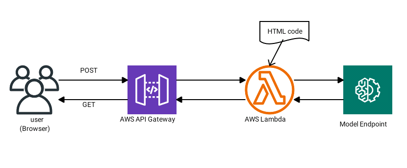

# Yoga pose Image Classification with VGG16.
## Model finetuning in AWS SageMaker: script mode, hyperparameter tuning, model profiling and debugger, custom dataset, and others good ML engineering practices.

In this project VGG16 image classification model is finetuned with a custom dataset of yoga pose images.

The dataset contains 107 classes of images, each one corresponding to a yoga pose.

The VGG16 image classification model is optimized with with Adadelta gradient descent optimization method insted of the usual SGD optimization method.

The model is submited and deployed in AWS Sagemaker.

The code is written in Sagemaker Python SDK, with few lines in boto3 and AWS CLI for illustration or simplicity.

## Model creation
The project was shared into 4 notebooks to facilitate comprehension of the ML pipeline.
The notebooks illustrate the steps of data ETL, model definition and hyperparameter tuning, profiler and debugger, and model training and deployment.

### 1) Data ETL notebook: `convert_image_mode2rgb.ipynb`

Tha dataset is downloaded and explored. Some issues are fixed and the images mode are converted to 3-channel RGB mode.
The original Yoga Pose Image Classification dataset can be downloaded from kaggle:
https://www.kaggle.com/datasets/shrutisaxena/yoga-pose-image-classification-dataset (shrutisaxena/yoga-pose-image-classification-dataset).
The transfrmed dataset, used to finetune the model in this project, is composed of 3-channel RGB mode images only, is also available at kaggle: https://www.kaggle.com/datasets/franciscadossantos/rgb-only-yoga-pose-dataset (franciscadossantos/rgb-only-yoga-pose-dataset).
To know more about the convertion methods used to transform the images mode see the notebook [convert_image_mode2rgb.ipynb](./convert_image_mode2rgb.ipynb).


### 2) Model definition and Hyperparameter tuning notebook: `hyperparameter_tuning.ipynb`

First the dataset is splited in train, validation, and test sets (with respective proportions of 0.7, 0.1, 0.2). Manifest files are created and the data is uploaded to s3.
The model is finetuned in AWS Sagemaker using PyTorch as ML framework. Finetuning is performed in 4 steps for different ranges of the following hyperparameters: epoch, batch size, test batch size, and learning rate as described bellow:

1- Hyperparameter Tuning Job

```
hyperparameter_ranges = {
    "lr": ContinuousParameter(0.005, 0.015, scaling_type='Logarithmic'),
    "batch_size": CategoricalParameter([16, 20, 30, 40]),
    "test_batch_size": CategoricalParameter([10, 16, 20]),
    "epochs": CategoricalParameter([5, 10])
}
```

2- Warm Start Hyperparameter Tuning
<br />

Performed to broad the possibilities of hyperparameters tuned.

3- Second Hyperparameter Tuning Job

In this step the hyperparameter `epoch` is excluded from the set of hyperparameter to be tuned and its value is kept static and equal to 6.
In addition, the range of hyperparameters to be tuned is narrowed to an interval that showed better performance in the previous step.

```
#static hyperparameters
hyperparameters = {"epochs": "6"}

hyperparameter_ranges = {
    "lr": ContinuousParameter(0.015, 0.125, scaling_type='Logarithmic'),
    "batch_size": CategoricalParameter([16, 20, 30]),
    "test_batch_size": CategoricalParameter([16, 20])
}
```

4- Second Warm Start Hyperparameter Tuning
<br />

In this step `test_batch_size` is excluded from the set of hyperparameter to be tuned and its value is kept static and equal to 20.
The range of values of `batch_size` to be tuned is narrowed based on results of previous step.

<pre>
#static hyperparameters
hyperparameters = {
    "epochs": "6",
    "test_batch_size": "20"
}

hyperparameter_ranges = {
    "lr": ContinuousParameter(0.120, 0.125, scaling_type='Logarithmic'),
    "batch_size": CategoricalParameter([20, 30])
}
</pre>

The Table bellow shows the result of all hyperparameter tuning jobs ordered by final objective value.


**Figure 1**: Table of hyperparameters
<br />
<br />

### 3) Profiler and Debugger notebook: `Sagemaker_Profiler_Debugger.ipynb`
Using the best hyperparameters from hyperparameter tunning step, the model is submited to debugging. The aim of this step is to detect training issues.
The profiler report is then saved in html format ([profiler-report.html](https://fsoaresantos.github.io/yoga-pose-ICP-profiler-reports/profiler-report.html)).

### 4) Model Deployment: `train_and_deploy.ipynb`
The model is trained and deployed.

## Yoga Pose API
The API allows the user to use the model to classify a yoga pose in an image file. It can be accessed at the link:
`https://j4ddwyyv1k.execute-api.us-east-1.amazonaws.com/DEV/getyogaapp`

### API Workflow:



**Figure 2**: Yoga pose API diagram
<br />
<br />

## Results/Insights and possible applications

The training process was performed over 30 epochs only, due to resource restrictions. The model achieved an average test loss of 0.128 and a test accuracy of 34.466%. However, it's possible that an increase in the number of epochs to over 50 will result in a better model performance.

AI can detect yoga pose and could potentially be used as an aid to accelerometers and gyroscope (which detects the speed and direction of movements) in fitness tracking applications, like Nintendo's Ring Fit Adventure, for instance, and many Yoga applications, to supervise the correct positioning of the body (body posture) during physical exercises.


## Important links

* [:notebook: Yoga Pose API documentation](./yoga-pose-api.md)
* [:scroll: 3-channel RGB mode image convertion method](./convert_image_mode2rgb.ipynb)
* [:open_file_folder: RGB-only Yoga Pose Dataset](https://www.kaggle.com/datasets/franciscadossantos/rgb-only-yoga-pose-dataset)
* [:lotus_position: Yoga Pose API](https://j4ddwyyv1k.execute-api.us-east-1.amazonaws.com/DEV/getyogaapp)
* [:woman_student: Udacity's AWS Machine Learning Engineer Nanodegree](https://www.udacity.com/course/aws-machine-learning-engineer-nanodegree--nd189)
* [:gear: AWS](https://aws.amazon.com/)

## Get in touch

* [:speaking_head: LinkedIn](https://www.linkedin.com/in/francisca-dos-santos-bronner/)
